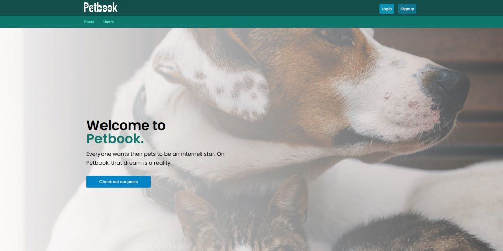
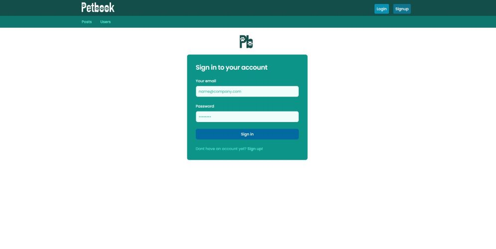
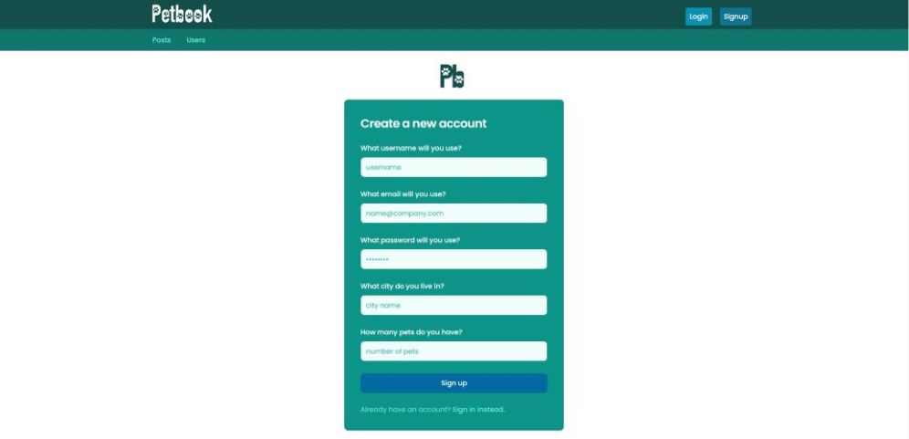

# Pet-Social-App

## Description
There is no doubt that animals can make people happier. Whether it's a playful puppy, a purring cat, or a majestic horse, 

animals have a way of bringing joy into our lives. Research has shown that spending time with animals can reduce stress, anxiety, 

and depression, and increase feelings of happiness and well-being. Animals can provide companionship, comfort, and a sense of purpose, 

which can be especially beneficial for those who are feeling lonely or isolated. Overall, animals have a unique ability to lift 

our spirits and bring us joy, which is why they are often used in therapeutic settings to help improve people's mental and 

emotional well-being. 

So what is PetBook? PetBook is a photo/video pet sharing social network that allows users to upload media of their animals

that can be shared publicly. Users can browse other users content and interact with them by liking, commenting and following each other to help bring joy to their life. 
***

## Table of Contents
- [Usage](#usage)
- [Links](#links)
- [Visual](#visual)
- [Collaborators](#collaborators)

***

## Usage
Technologies that we incorporated in this project were 
- React
- TailWind 
- Cloudinary
- GraphQL 
- Node.js 
- Express.js 
- MonogoDB 
- Mongoose 
***

## Links
[Link to our GitHub Repo](https://github.com/carsondipan/pet-social-app)

[Link to our Presentation](https://docs.google.com/presentation/d/1N7n1riX8UsVIPt-Klb8gXzMwMwtWmRu37VAxrz3Vx6g/edit#slide=id.p)

***

## Visual

***

## Collaborators
[Erin's GitHub](https://github.com/uiido)

[Ashley's GitHub](https://github.com/alandis01)

[Carson's GitHub](https://github.com/carsondipan)

[Samson's GitHub](https://github.com/SamsonKnightz)

[Justin's GitHub](https://github.com/M5Justin)

[Kyle's GitHub](https://github.com/KMPhillips20)